# Bayesian Federated Learning Framework (Class Diagram)

This document describes the design of the current `bayesfl_base_source` codebase. The code is organized mostly as Python modules plus a small number of concrete classes. In this document, a **module** such as `model.py` or `observability.py` is also treated as a design-level component because it owns a clear responsibility and exposes a public API used by the rest of the framework.

The diagrams are written in **Mermaid.js**. GitHub, GitLab, many Markdown previews, and VS Code Mermaid extensions can render them directly from the Markdown file. You can also copy any `mermaid` block into the Mermaid Live Editor.

---

## Table of contents

- [I. Class dependency](#11)
- [II. Runtime flow diagrams](#12)
- [III. Class/module `main`](#13)
- [IV. Class `config.RunConfig`](#14)
- [V. Class/module `dataset`](#15)
- [VI. Class/module `model`](#16)
- [VII. Class/module `bayes_vi`](#17)
- [VIII. Class `client.GroupedBayesClient`](#18)
- [IX. Class `strategy.GroupedBayesStrategy`](#19)
- [X. Class/module `selector`](#110)
- [XI. Class/module `observability`](#111)
- [XII. Class/module `utils`](#112)
- [XIII. Extension points](#113)

---

## &emsp;I. Class dependency <a id="11"></a>

### I.1. Component dependency table

| **Class / module name** | **Detail information** | **Reference** |
| :--- | :--- | :--- |
| `main` | Experiment entry point. Parses config, loads data, initializes global payload, builds Flower client factory and server strategy, launches simulation, saves final model and all metrics. | [REF](#13) |
| `config.RunConfig` | Dataclass containing all CLI/runtime options: method, dataset, FL population, optimizer, VI/OLA hyperparameters, device/Ray resources, and observability options. | [REF](#14) |
| `dataset.DataBundle` | Dataclass returned by `load_federated_data`. Holds client train/validation datasets, global test loader, label counts, virtual-client grouping, and synthetic device geometry. | [REF](#15) |
| `dataset` | Dataset loading and partitioning module. Supports MNIST/CIFAR-10, IID/non-IID, balanced/unbalanced splits, client label summaries, and device grouping. | [REF](#15) |
| `model.MLP` | Deterministic MLP model used by FedAvg, OLA/FOLA, and VI parameter-shape compatibility. | [REF](#16) |
| `model.SmallCNN` | Small deterministic CNN model used by FedAvg/OLA on MNIST or CIFAR-10. VI currently supports only MLP. | [REF](#16) |
| `model` | Model/training/evaluation service. Provides model construction, flat-parameter utilities, local deterministic training, OLA prior loss, Fisher collection, accuracy/loss helpers. | [REF](#16) |
| `bayes_vi.BayesianMlpSpec` | MLP latent-weight specification for Pyro VI. Stores latent site names and shapes and exposes `latent_dim`. | [REF](#17) |
| `bayes_vi` | Pyro VI module. Builds a Bayesian MLP, runs local SVI, extracts posterior loc/scale, and returns VI diagnostics. | [REF](#17) |
| `client.GroupedBayesClient` | Flower virtual client. Each object simulates a group of physical devices and dispatches local training to FedAvg, OLA/FOLA, or VI. | [REF](#18) |
| `strategy.GroupedBayesStrategy` | Server-side Flower strategy. Selects physical clients, configures fit, aggregates FedAvg/VI/OLA payloads, evaluates global model, and writes observability artifacts. | [REF](#19) |
| `selector.SelectionResult` | Dataclass containing selected physical client IDs for one round and the policy name. | [REF](#110) |
| `selector.BaseClientSelector` | Abstract selection-policy interface. | [REF](#110) |
| `selector.RandomClientSelector` | Active selection policy. Uniformly samples a fraction of physical devices each round. | [REF](#110) |
| `selector.WirelessQualitySelector` | Placeholder/TODO class for future channel-aware, OTA-aware, or digital-link-aware client selection. | [REF](#110) |
| `observability` | Metrics and logging module. Computes posterior summaries, SNR histograms, calibration metrics, local/global summaries, aggregation diagnostics, and stable CSV output. | [REF](#111) |
| `utils` | Offline plotting module. Reads CSV files and creates PNG plots: metric curves, mixed method curves, selected clients, radar plot, SNR density/CDF, reliability diagram. | [REF](#112) |

### I.2. High-level dependency diagram

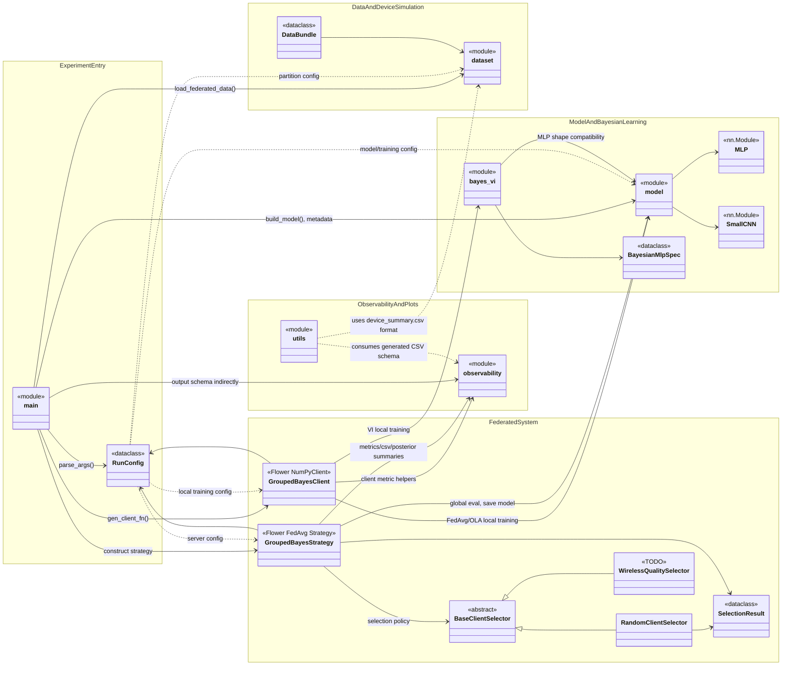

---

## &emsp;II. Runtime flow diagrams <a id="12"></a>

### II.1. End-to-end experiment flow

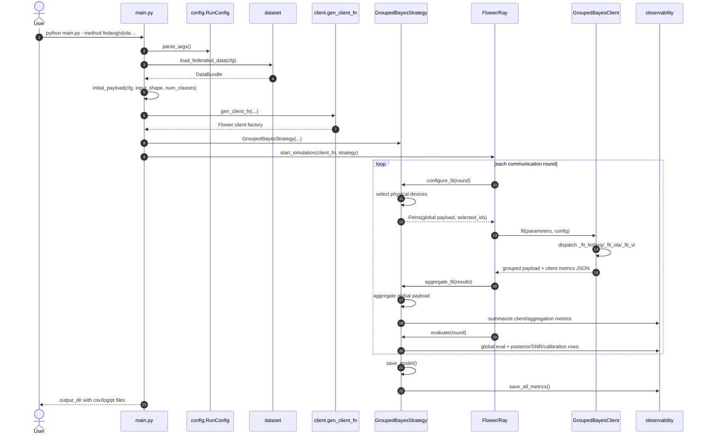

### II.2. Method-specific local training flow

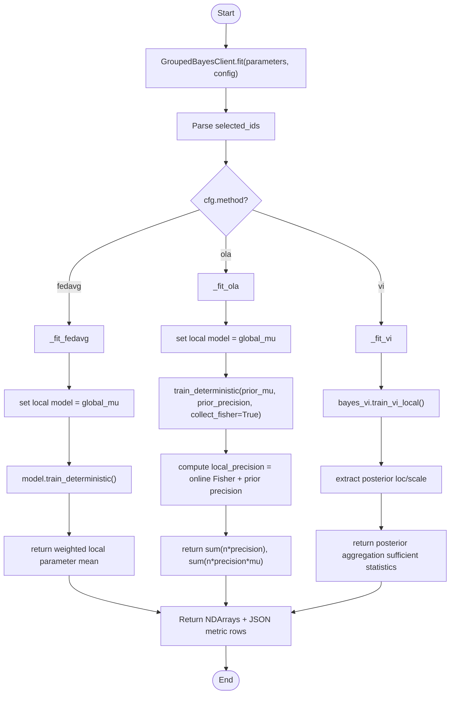

---

## &emsp;III. Class/module `main` <a id="13"></a>

`main.py` is not a class. It is the top-level orchestration module.

### III.1. Module diagram

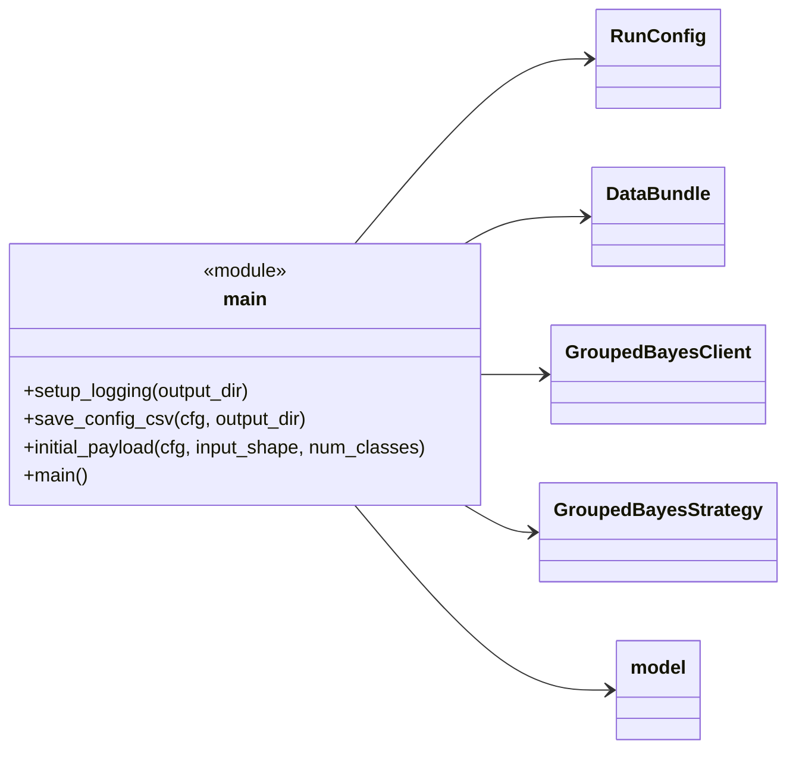

### III.2. Module responsibilities

| **Function** | **Detail information** |
| :--- | :--- |
| `setup_logging(output_dir)` | Creates/initializes file and console logging. Training logs are saved as `.log` files in the output folder. |
| `save_config_csv(cfg, output_dir)` | Writes the resolved runtime configuration to `config.csv`. |
| `initial_payload(cfg, input_shape, num_classes)` | Creates the initial global payload. FedAvg uses `[mu]`, VI uses `[loc, scale]`, OLA uses `[mu, precision]`. |
| `main()` | Full experiment entry point: parse CLI, seed runtime, load data, create Flower client factory and strategy, run simulation, save model and metrics. |

---

## &emsp;IV. Class `config.RunConfig` <a id="14"></a>

`RunConfig` is the central configuration dataclass. It is created by `parse_args()` and passed into almost every other module.

### IV.1. Class diagram

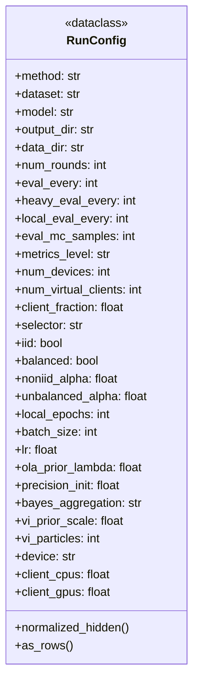

### IV.2. Class attributes

| **Class attributes** | **Detail information** |
| :--- | :--- |
| `method` | Selected training method: `fedavg`, `vi`, or `ola`. |
| `dataset`, `model` | Dataset/model selection. Dataset supports `mnist` and `cifar10`; model supports `mlp` and `cnn`, but VI currently supports `mlp` only. |
| `output_dir`, `data_dir` | Result folder and dataset folder. |
| `num_rounds`, `eval_every`, `heavy_eval_every` | Communication-round count and evaluation frequency controls. |
| `local_eval_every`, `local_eval_fraction` | Local/client evaluation frequency and fraction. |
| `eval_mc_samples` | Number of Monte Carlo samples for Bayesian predictive metrics. |
| `calibration_bins`, `snr_hist_bins` | Number of bins used for calibration and SNR histogram outputs. |
| `save_posterior_every`, `save_prediction_snapshots` | Posterior and prediction snapshot controls. |
| `metrics_level` | Observability level: `basic`, `bayes`, or `full`. |
| `seed` | Global seed for reproducibility. |
| `num_devices`, `num_virtual_clients`, `client_fraction` | Physical-device count, Flower virtual-client count, and selected physical-client fraction. |
| `selector` | Client-selection policy. Currently `random`; `wireless_todo` is reserved. |
| `iid`, `balanced`, `noniid_alpha`, `unbalanced_alpha`, `val_ratio`, `min_client_examples`, `class_balance` | Dataset partitioning controls. |
| `area_radius_m` | Synthetic device-layout radius for radar/wireless metadata. |
| `local_epochs`, `batch_size`, `lr`, `momentum`, `weight_decay`, `optimizer` | Local deterministic optimizer/training controls. |
| `mlp_hidden` | MLP hidden sizes as a comma-separated string or list. |
| `ola_prior_lambda`, `precision_init`, `precision_floor`, `fisher_clip` | OLA/FOLA prior penalty, initial precision, precision floor, and Fisher clipping. |
| `bayes_aggregation`, `vi_prior_scale`, `vi_init_scale`, `vi_min_scale`, `vi_particles`, `vi_lr` | VI/Bayes-by-Backprop style controls. |
| `client_cpus`, `client_gpus`, `num_workers`, `torch_threads`, `device`, `cache_clients`, `accept_failures` | Flower/Ray/PyTorch runtime resource controls. |
| `dry_run` | Debug flag for future validation-only execution. |

### IV.3. Class methods and module functions

| **Class / module methods** | **Detail information** |
| :--- | :--- |
| `RunConfig.normalized_hidden()` | Converts `mlp_hidden` to a list of integers. |
| `RunConfig.as_rows()` | Converts config fields into `(key, value)` rows for `config.csv`. |
| `str2bool(value)` | Converts CLI boolean strings to `bool`. |
| `int_list(value)` | Parses comma-separated integers. |
| `parse_args()` | Parses CLI arguments, validates constraints, and returns `RunConfig`. |

---

## &emsp;V. Class/module `dataset` <a id="15"></a>

The dataset module is independent from Flower so it can be tested separately.

### V.1. Class diagram

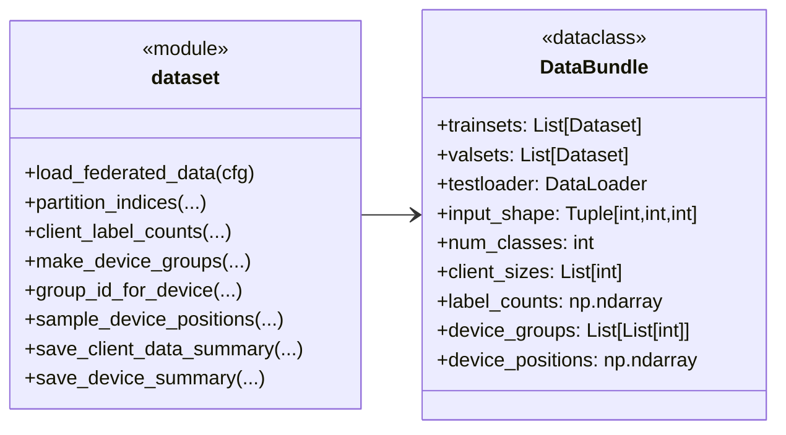

### V.2. `DataBundle` attributes

| **Class attributes** | **Detail information** |
| :--- | :--- |
| `trainsets` | One local training dataset per physical client. |
| `valsets` | One local validation dataset per physical client. May contain empty subsets if `val_ratio=0`. |
| `testloader` | Central/global test loader used by the server for global evaluation. |
| `input_shape` | Input tensor shape as `(channels, height, width)`. |
| `num_classes` | Number of target classes. |
| `client_sizes` | Number of training examples for each physical client. |
| `label_counts` | Matrix of shape `num_devices x num_classes` with per-client label counts. |
| `device_groups` | Mapping from Flower virtual-client ID to physical-device IDs. |
| `device_positions` | Synthetic device coordinates and radius metadata for radar/wireless plots. |

### V.3. Module methods

| **Module methods** | **Detail information** |
| :--- | :--- |
| `load_federated_data(cfg)` | Loads the selected dataset, partitions it into physical-client subsets, creates validation splits, test loader, label counts, virtual-client groups, and device positions. |
| `_load_base_dataset(dataset_name, data_dir)` | Loads/downloads MNIST or CIFAR-10 through TorchVision. |
| `partition_indices(...)` | Creates physical-client index lists under IID/non-IID and balanced/unbalanced settings. |
| `_label_skew_split_by_lengths(...)` | Dirichlet label-skew partitioning for non-IID clients. |
| `_balanced_lengths(...)` | Produces nearly equal client sizes. |
| `_dirichlet_lengths(...)` | Produces unbalanced client sizes using a Dirichlet distribution. |
| `_split_list_by_lengths(...)` | Splits index lists by requested lengths. |
| `_get_targets(dataset)` | Extracts labels from TorchVision datasets or nested subsets. |
| `_class_balance_dataset(dataset, num_classes, seed)` | Optionally balances class counts before partitioning. |
| `client_label_counts(indices_per_client, targets, num_classes)` | Computes label-count matrix for all clients. |
| `make_device_groups(num_devices, num_virtual_clients)` | Groups many physical devices into fewer Flower virtual clients. |
| `group_id_for_device(device_id, groups)` | Returns the virtual-client group ID owning a physical device. |
| `sample_device_positions(num_devices, device_groups, radius_m, seed)` | Generates deterministic polar coordinates for radar/future wireless experiments. |
| `save_client_data_summary(path, bundle, cfg)` | Writes static client heterogeneity metadata. |
| `save_device_summary(path, bundle, cfg)` | Writes static device geometry/group metadata. |

---

## &emsp;VI. Class/module `model` <a id="16"></a>

`model.py` owns deterministic neural-network models and local training/evaluation helpers.

### VI.1. Class diagram

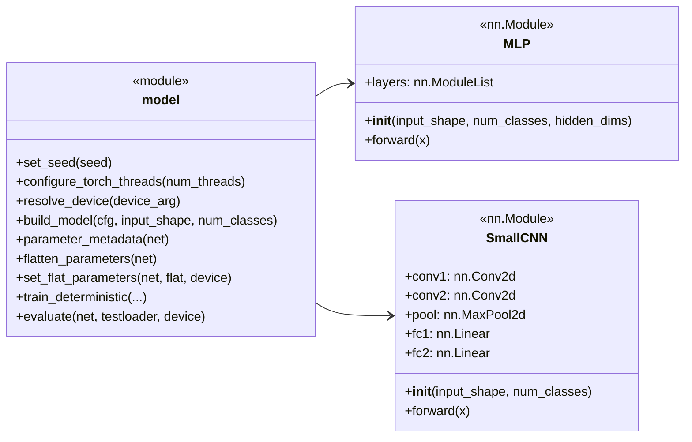

### VI.2. Class `MLP` attributes

| **Class attributes** | **Detail information** |
| :--- | :--- |
| `layers` | `nn.ModuleList` of fully connected layers. Dimensions are `[input_dim] + hidden_dims + [num_classes]`. |

### VI.3. Class `MLP` methods

| **Class methods** | **Detail information** |
| :--- | :--- |
| `__init__(input_shape, num_classes, hidden_dims)` | Builds a fully connected classifier. |
| `forward(x)` | Flattens image input and applies ReLU after all hidden layers. Returns logits. |

### VI.4. Class `SmallCNN` attributes

| **Class attributes** | **Detail information** |
| :--- | :--- |
| `conv1`, `conv2` | Two convolution layers. |
| `pool` | Max-pooling layer. |
| `fc1`, `fc2` | Fully connected classifier head. |

### VI.5. Class `SmallCNN` methods

| **Class methods** | **Detail information** |
| :--- | :--- |
| `__init__(input_shape, num_classes)` | Builds a small CNN compatible with MNIST and CIFAR-10. |
| `forward(x)` | Applies convolution, ReLU, pooling, flattening, and linear classifier layers. Returns logits. |

### VI.6. Module methods

| **Module methods** | **Detail information** |
| :--- | :--- |
| `set_seed(seed)` | Sets Python, NumPy, and Torch seeds. |
| `configure_torch_threads(num_threads)` | Prevents CPU oversubscription inside Ray workers. |
| `resolve_device(device_arg)` | Resolves `auto`, `cpu`, or `cuda` into a `torch.device`. |
| `build_model(cfg, input_shape, num_classes)` | Creates `MLP` or `SmallCNN` from config. |
| `trainable_parameters(net)` | Returns trainable parameters. |
| `parameter_shapes(net)` | Returns shapes of trainable parameters. |
| `parameter_metadata(net)` | Returns parameter names, shapes, and flat-vector slices. |
| `num_parameters(net)` | Counts trainable parameters. |
| `flatten_parameters_tensor(net)` | Differentiably flattens model parameters into one tensor. |
| `flatten_parameters(net)` | Flattens parameters into a NumPy vector. |
| `set_flat_parameters(net, flat, device)` | Loads a flat vector into a model. |
| `build_optimizer(cfg, net)` | Creates SGD or Adam optimizer. |
| `_stat(arr, key)` | Internal helper for numeric summary statistics. |
| `train_deterministic(...)` | Local deterministic training. Supports FedAvg and OLA prior loss/Fisher collection. Returns total loss, optional Fisher diagonal, and stats. |
| `evaluate(net, testloader, device)` | Evaluates deterministic model loss and accuracy. |

---

## &emsp;VII. Class/module `bayes_vi` <a id="17"></a>

The VI module implements Pyro-based mean-field variational Bayesian learning for MLPs.

### VII.1. Class diagram

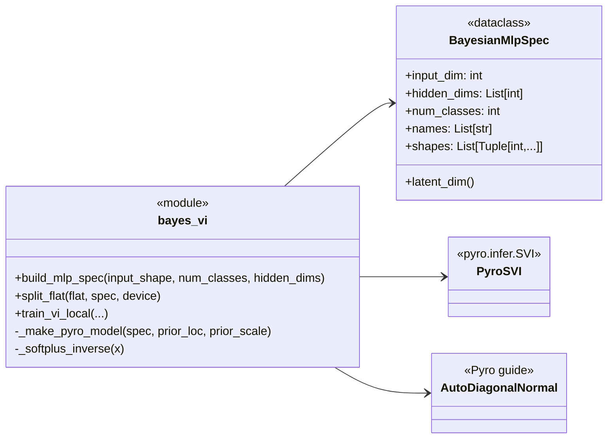

### VII.2. Class `BayesianMlpSpec` attributes

| **Class attributes** | **Detail information** |
| :--- | :--- |
| `input_dim` | Flattened input dimension. |
| `hidden_dims` | MLP hidden-layer sizes. |
| `num_classes` | Number of output classes. |
| `names` | Ordered Pyro latent-site names matching MLP parameter order. |
| `shapes` | Ordered parameter shapes matching `names`. |

### VII.3. Class `BayesianMlpSpec` methods

| **Class methods** | **Detail information** |
| :--- | :--- |
| `latent_dim()` | Returns total number of latent weight/bias parameters. |

### VII.4. Module methods

| **Module methods** | **Detail information** |
| :--- | :--- |
| `build_mlp_spec(input_shape, num_classes, hidden_dims)` | Creates latent-site names and shapes compatible with `model.MLP`. |
| `split_flat(flat, spec, device)` | Splits a flat latent vector into named tensors. |
| `_softplus_inverse(x)` | Internal helper for scale initialization. |
| `_make_pyro_model(spec, prior_loc, prior_scale)` | Creates the Pyro model closure for Bayesian MLP classification. |
| `train_vi_local(...)` | Runs local Pyro SVI and returns posterior `loc`, `scale`, and metrics such as ELBO/KL/likelihood/scale/SNR summaries. |

---

## &emsp;VIII. Class `client.GroupedBayesClient` <a id="18"></a>

`GroupedBayesClient` is the virtual-client side of the simulation. One Flower client can sequentially simulate many physical devices.

### VIII.1. Class diagram

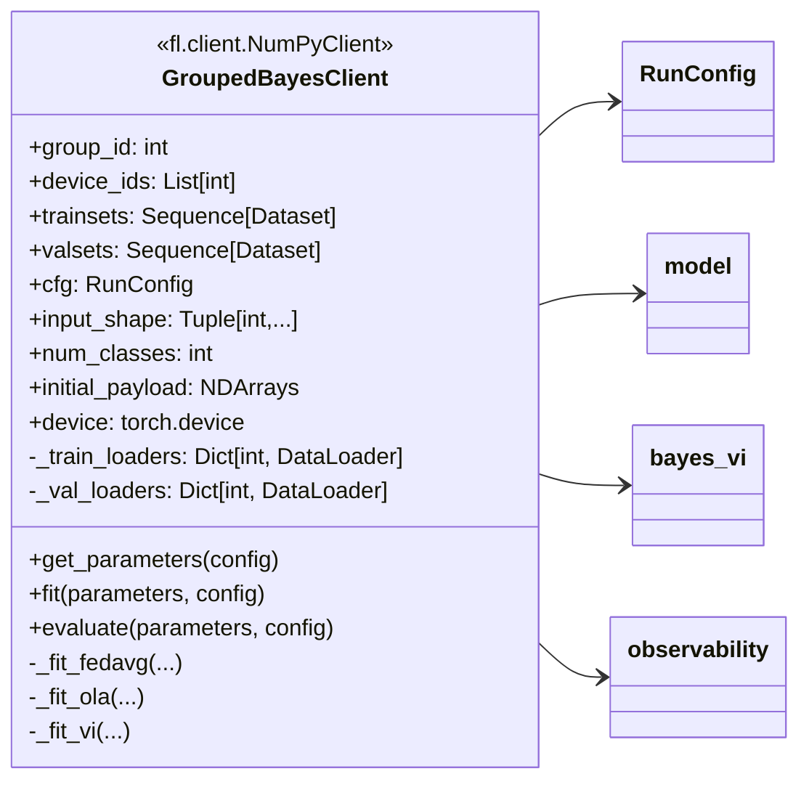

### VIII.2. Class attributes

| **Class attributes** | **Detail information** |
| :--- | :--- |
| `group_id` | Flower virtual-client ID. |
| `device_ids` | Physical-device IDs owned by this virtual client. |
| `trainsets`, `valsets` | Local datasets for all physical devices. The client only uses entries belonging to `device_ids`. |
| `cfg` | Global run configuration. |
| `input_shape`, `num_classes` | Model input/output metadata. |
| `initial_payload` | Initial global payload returned before training starts. |
| `device` | PyTorch device resolved from config. |
| `_train_loaders`, `_val_loaders` | Cached DataLoaders per physical device. |

### VIII.3. Class methods

| **Class methods** | **Detail information** |
| :--- | :--- |
| `__init__(...)` | Stores group metadata, datasets, config, device, and initial payload. |
| `get_parameters(config)` | Returns a copy of the initial payload. |
| `_loader_for(device_id)` | Creates/caches training DataLoader for one physical device. |
| `_val_loader_for(device_id)` | Creates/caches validation DataLoader for one physical device if available. |
| `fit(parameters, config)` | Flower training entry point. Parses selected physical clients and dispatches to `_fit_fedavg`, `_fit_ola`, or `_fit_vi`. Returns grouped payload and JSON-encoded metric rows. |
| `_base_client_row(did, server_round, n)` | Creates shared client-training metric row fields. |
| `_maybe_eval_local_model(did, server_round, local_model)` | Optionally evaluates local model on its local validation set. |
| `_fit_fedavg(parameters, active_ids, server_round)` | Simulates FedAvg local training for selected physical devices and returns weighted parameter average. |
| `_fit_ola(parameters, active_ids, server_round)` | Simulates FOLA local training with prior loss and empirical Fisher. Returns precision-weighted aggregation sufficient statistics. |
| `_fit_vi(parameters, active_ids, server_round)` | Runs local Pyro VI and returns posterior aggregation sufficient statistics. |
| `evaluate(parameters, config)` | Flower client evaluation placeholder. Server-side centralized evaluation is used instead. |
| `_partition_id_from_context(context)` | Module helper to support current and older Flower client factory APIs. |
| `gen_client_fn(...)` | Module helper returning a Flower client factory with optional caching. |

---

## &emsp;IX. Class `strategy.GroupedBayesStrategy` <a id="19"></a>

`GroupedBayesStrategy` is the server-side controller. It subclasses Flower `FedAvg`, but overrides fit configuration, aggregation, evaluation, and output saving.

### IX.1. Class diagram

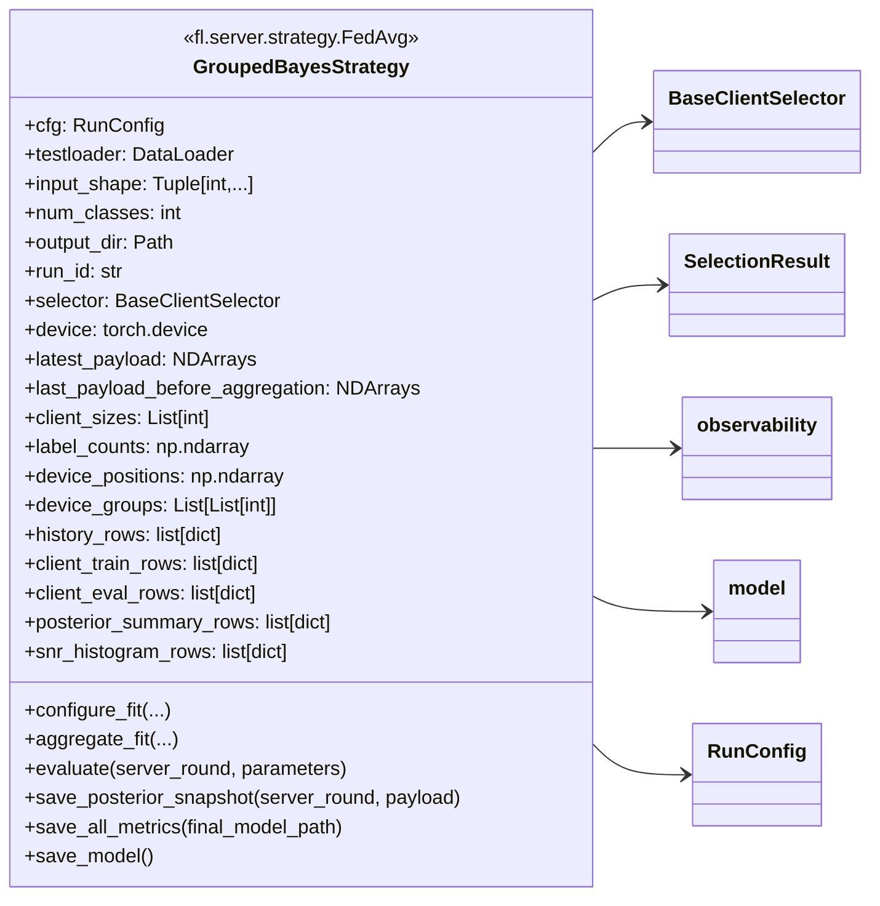

### IX.2. Class attributes

| **Class attributes** | **Detail information** |
| :--- | :--- |
| `cfg` | Runtime config. |
| `testloader` | Global test loader used for server-side evaluation. |
| `input_shape`, `num_classes` | Model metadata. |
| `output_dir`, `run_id` | Output directory and run identifier. |
| `selector` | Physical-client selection policy object. |
| `device` | Server evaluation device. |
| `latest_payload` | Current global payload. FedAvg: `[mu]`; VI: `[loc, scale]`; OLA: `[mu, precision]`. |
| `last_payload_before_aggregation` | Payload before the current aggregation step, used for aggregation diagnostics. |
| `client_sizes`, `label_counts` | Per-client dataset metadata. |
| `device_positions`, `device_groups`, `gid_lookup` | Device geometry and virtual-client ownership metadata. |
| `label_entropy`, `label_kl`, `dominant_label`, `dominant_label_fraction` | Precomputed data-heterogeneity metadata. |
| `base_eval_model` | Deterministic model shell used for evaluation/metadata. |
| `param_meta` | Flat-slice parameter metadata used for posterior layer summaries. |
| `history_rows` | Main `metrics.csv` rows. |
| `run_summary_rows` | Final `run_summary.csv` rows. |
| `selection_summary_rows`, `selected_client_rows`, `communication_rows` | Selection and future wireless metric rows. |
| `client_train_rows`, `client_eval_rows` | Client-level training/evaluation metric rows. |
| `calibration_rows`, `posterior_summary_rows`, `snr_histogram_rows`, `aggregation_rows` | Bayesian/calibration/aggregation diagnostic rows. |
| `last_selection`, `last_fit_metrics` | State for the latest round. |
| `round_start_time`, `fit_start_time`, `aggregate_time_sec`, `start_time` | Runtime timing state. |

### IX.3. Class methods

| **Class methods** | **Detail information** |
| :--- | :--- |
| `__init__(...)` | Initializes strategy state, selector, output rows, payload, metadata, and Flower parent strategy. |
| `configure_fit(server_round, parameters, client_manager)` | Selects physical clients, records selection rows, sends selected IDs and current payload to all virtual clients. |
| `_record_selection_rows(server_round, selection)` | Writes round-level selection, selected-client, and communication placeholder rows. |
| `aggregate_fit(server_round, results, failures)` | Main aggregation entry. Parses client metric JSON, chooses FedAvg/VI/OLA aggregation, computes aggregation diagnostics, and updates `latest_payload`. |
| `_load_metric_json(value)` | Parses JSON metric rows returned by clients through Flower scalar metrics. |
| `_augment_client_row(row)` | Adds server-known data heterogeneity/device metadata to client rows. |
| `_aggregate_fedavg(active_results, total_examples)` | Weighted parameter averaging for FedAvg. |
| `_aggregate_product_precision(active_results, total_examples, return_scale)` | Precision/product aggregation for OLA and VI product mode. |
| `_aggregate_moment_match(active_results, total_examples)` | Mean/moment aggregation fallback for VI mean mode. |
| `evaluate(server_round, parameters)` | Global server evaluation and round-level metric generation. Also records posterior, SNR, and calibration rows when scheduled. |
| `_should_save_posterior(server_round)` | Decides if posterior snapshot should be saved this round. |
| `save_posterior_snapshot(server_round, payload)` | Saves `.pt` posterior payload and metadata. |
| `save_history_csv()` | Writes main `metrics.csv`. |
| `save_all_metrics(final_model_path)` | Writes all observability CSV files. |
| `save_selection_csv()` | Compatibility helper for selection CSV output. |
| `_build_run_summary(final_model_path)` | Builds final one-row run summary. |
| `save_model()` | Saves final deterministic model state dict to `final_model.pt`. |

---

## &emsp;X. Class/module `selector` <a id="110"></a>

The selector module is the extension point for client scheduling.

### X.1. Class diagram

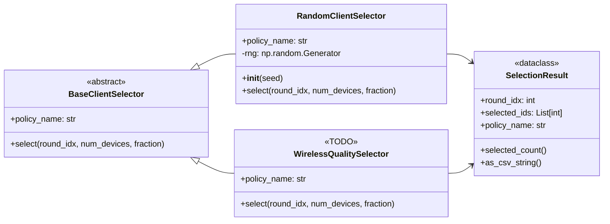

### X.2. Class attributes

| **Class attributes** | **Detail information** |
| :--- | :--- |
| `SelectionResult.round_idx` | Communication round. |
| `SelectionResult.selected_ids` | Selected physical-client IDs. |
| `SelectionResult.policy_name` | Name of selection policy. |
| `BaseClientSelector.policy_name` | Human-readable policy identifier. |
| `RandomClientSelector.rng` | NumPy random generator used for reproducible random selection. |
| `WirelessQualitySelector.policy_name` | Placeholder policy identifier for future wireless scheduling. |

### X.3. Class and module methods

| **Class / module methods** | **Detail information** |
| :--- | :--- |
| `SelectionResult.selected_count()` | Returns number of selected clients. |
| `SelectionResult.as_csv_string()` | Serializes selected IDs for Flower scalar config. |
| `BaseClientSelector.select(...)` | Abstract selection API. |
| `RandomClientSelector.__init__(seed)` | Initializes random generator. |
| `RandomClientSelector.select(round_idx, num_devices, fraction)` | Uniformly samples a fixed fraction of physical clients. |
| `WirelessQualitySelector.select(...)` | Not implemented yet; reserved for channel-aware scheduling. |
| `build_selector(policy, seed)` | Factory for selector objects. |
| `parse_selected_ids(value)` | Parses selected IDs sent through Flower fit config. |

---

## &emsp;XI. Class/module `observability` <a id="111"></a>

`observability.py` is a module, not a class. It centralizes metrics and CSV generation logic so `strategy.py` and `client.py` remain readable.

### XI.1. Module diagram

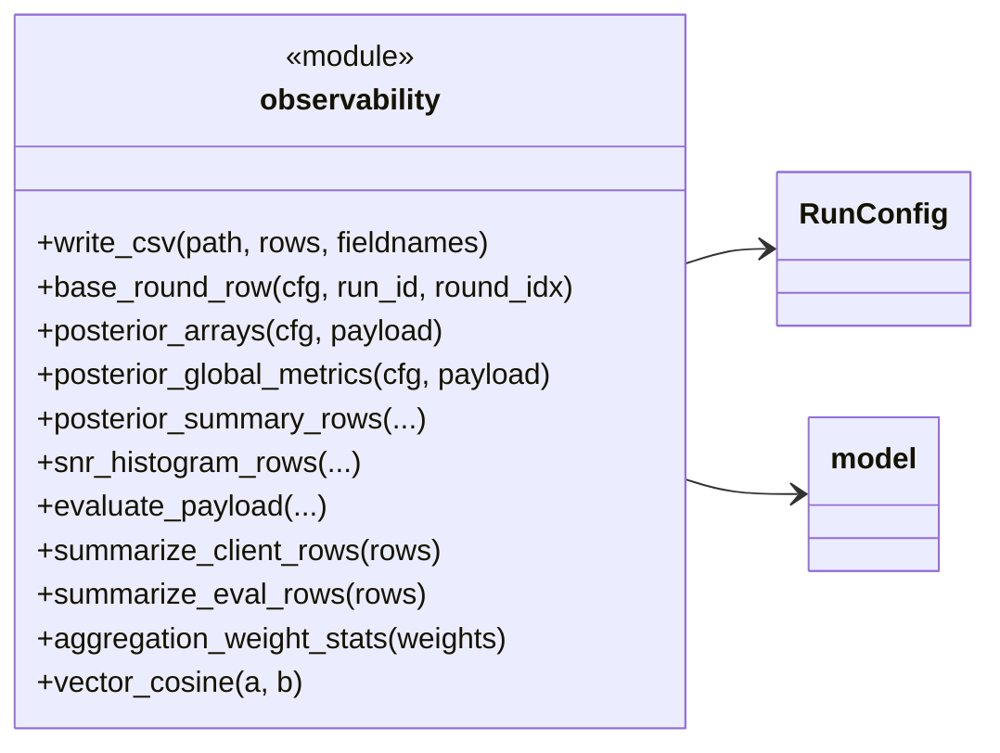

### XI.2. Module constants / pseudo-attributes

| **Module attributes** | **Detail information** |
| :--- | :--- |
| `SCHEMA_VERSION` | Version label used in every observability CSV row. |
| CSV field-name lists | Stable header definitions for `metrics.csv`, `client_train_metrics.csv`, `client_eval_metrics.csv`, `posterior_summary.csv`, `snr_histograms.csv`, `calibration_bins.csv`, `aggregation_diagnostics.csv`, `communication_metrics.csv`, and `run_summary.csv`. |

### XI.3. Module methods

| **Module methods** | **Detail information** |
| :--- | :--- |
| `nan()` | Returns a floating NaN. |
| `is_finite_number(x)` | Checks if a value is a finite number. |
| `float_or_nan(x)` | Converts valid numbers to float, otherwise NaN. |
| `safe_mean(values)` | Mean that tolerates empty/invalid inputs. |
| `weighted_mean(rows, value_key, weight_key)` | Weighted mean from row dictionaries. |
| `percentile(arr, q)` | Robust percentile helper. |
| `array_stats(arr, prefix, include_abs)` | Produces mean/std/min/percentile/max scalar summaries. |
| `finite_or_empty(value)` | Converts non-finite values to empty strings for CSV. |
| `write_csv(path, rows, fieldnames)` | Writes stable-header CSV files. |
| `base_round_row(cfg, run_id, round_idx)` | Creates the common row fields for `metrics.csv`. |
| `entropy_from_counts(counts)` | Label entropy from class counts. |
| `kl_to_global(counts, global_probs)` | KL divergence between client label distribution and global label distribution. |
| `label_metadata(label_counts)` | Returns label entropy, KL, dominant label, and dominant-label fraction arrays. |
| `posterior_arrays(cfg, payload)` | Converts FedAvg/VI/OLA payload into `(mu, sigma, precision)`. |
| `snr_values(mu, sigma)` | Computes `abs(mu) / sigma`. |
| `posterior_global_metrics(cfg, payload)` | Computes global posterior uncertainty/SNR scalar summaries. |
| `posterior_summary_rows(cfg, run_id, round_idx, payload, param_meta)` | Creates global/layer posterior summary rows. |
| `snr_histogram_rows(cfg, run_id, round_idx, payload, param_meta, bins)` | Creates SNR density/CDF histogram rows. |
| `_entropy_from_probs(probs)` | Internal predictive entropy helper. |
| `evaluate_payload(...)` | Evaluates deterministic or Bayesian payload, computing accuracy, loss, NLL, Brier, ECE, MCE, entropy, and calibration bins. |
| `prefixed(prefix, metrics)` | Prefixes dictionary keys. |
| `summarize_client_rows(rows)` | Aggregates client-training rows into round-level summaries. |
| `summarize_eval_rows(rows)` | Aggregates client-evaluation rows into round-level summaries. |
| `aggregation_weight_stats(weights)` | Computes entropy/min/max of aggregation weights. |
| `vector_cosine(a, b)` | Cosine similarity between two flat vectors. |

---

## &emsp;XII. Class/module `utils` <a id="112"></a>

`utils.py` is an offline plotting module. Training should not generate PNG files directly.

### XII.1. Module diagram

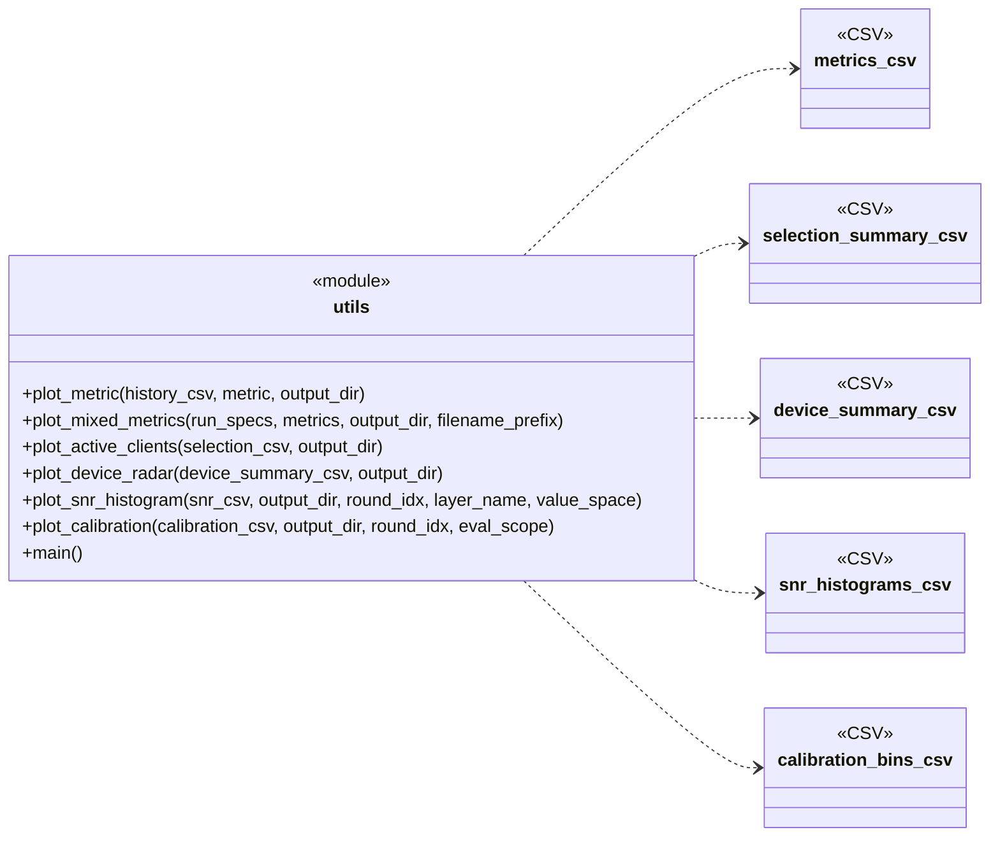

### XII.2. Module methods

| **Module methods** | **Detail information** |
| :--- | :--- |
| `_read_csv_rows(csv_path)` | Reads CSV rows using Python stdlib `csv`. |
| `_column_as_float(rows, column, csv_path)` | Extracts numeric column values from CSV rows. |
| `_save_figure(fig, out_path, dpi)` | Saves a Matplotlib figure without `tight_layout()` to avoid some broken NumPy/Matplotlib environments. |
| `_resolve_history_path(run_spec)` | Parses `label=run_path` or direct CSV paths for mixed plots. |
| `_load_metric_series(history_csv, metric)` | Loads one metric series from `metrics.csv`. |
| `plot_metric(history_csv, metric, output_dir)` | Creates a single metric-vs-round PNG. |
| `plot_mixed_metrics(run_specs, metrics, output_dir, filename_prefix)` | Creates overlay curves for multiple methods or hyperparameter runs. |
| `plot_active_clients(selection_csv, output_dir)` | Plots selected physical-client count per round. |
| `plot_device_radar(device_summary_csv, output_dir)` | Creates polar/radar device distribution plot. |
| `_filter_rows(rows, ...)` | Filters histogram/calibration CSV rows by round/scope/layer. |
| `plot_snr_histogram(snr_csv, output_dir, round_idx, layer_name, value_space)` | Creates SNR density and CDF plots. |
| `plot_calibration(calibration_csv, output_dir, round_idx, eval_scope)` | Creates a reliability diagram from calibration-bin data. |
| `main()` | CLI entry point for offline plotting. |

---

## &emsp;XIII. Extension points <a id="113"></a>

### XIII.1. Future wireless-aware client selection

The main extension point is `selector.WirelessQualitySelector`.

Recommended future interface:

```python
class WirelessQualitySelector(BaseClientSelector):
    def select(
        self,
        round_idx: int,
        num_devices: int,
        fraction: float,
        channel_state: dict[int, ChannelState],
        data_quality: dict[int, DataQuality],
        battery_state: dict[int, BatteryState],
    ) -> SelectionResult:
        ...
```

Expected future metrics should be written into:

```text
selection_summary.csv
selected_clients.csv
communication_metrics.csv
client_train_metrics.csv
aggregation_diagnostics.csv
```

### XIII.2. Future Bayesian metrics

The main metric extension point is `observability.py`. Add new scalar summaries to:

```text
metrics.csv
posterior_summary.csv
snr_histograms.csv
calibration_bins.csv
```

A recommended rule is:

```text
metrics.csv              -> compact round-level scalar summaries
client_*.csv             -> per-client rows
posterior_summary.csv    -> per-layer posterior statistics
snr_histograms.csv       -> density/CDF data
posterior_snapshots/*.pt -> full arrays for post-hoc analysis
```

### XIII.3. Future model support

To add a new model:

1. Add the model class in `model.py`.
2. Update `build_model()`.
3. Verify `parameter_metadata()`, `flatten_parameters()`, and `set_flat_parameters()` work.
4. If VI support is needed, add a matching Pyro specification in `bayes_vi.py`.

### XIII.4. Future aggregation methods

To add a method such as FedProx, FedCurv, FedNova, SCAFFOLD, or FedBE:

1. Add CLI fields to `RunConfig`.
2. Add a new branch in `GroupedBayesClient.fit()`.
3. Add server aggregation branch in `GroupedBayesStrategy.aggregate_fit()`.
4. Add method-specific fields to `observability.py` only if they are needed for research plots.

---

## Appendix A. Current output artifact ownership

| **Output artifact** | **Primary writer** | **Primary reader** |
| :--- | :--- | :--- |
| `config.csv` | `main.save_config_csv()` | Human / experiment tracker |
| `metrics.csv` | `GroupedBayesStrategy.save_history_csv()` | `utils.py metric`, `utils.py mix` |
| `run_summary.csv` | `GroupedBayesStrategy.save_all_metrics()` | Future sweep analysis |
| `client_data_summary.csv` | `dataset.save_client_data_summary()` | Future heterogeneity plots |
| `device_summary.csv` | `dataset.save_device_summary()` | `utils.py radar` |
| `selection_summary.csv` | `GroupedBayesStrategy.save_all_metrics()` | `utils.py selected` |
| `selected_clients.csv` | `GroupedBayesStrategy.save_all_metrics()` | Future selection-frequency plots |
| `client_train_metrics.csv` | Client JSON rows parsed by `GroupedBayesStrategy` | Future local training/drift plots |
| `client_eval_metrics.csv` | Client JSON rows parsed by `GroupedBayesStrategy` | Future local forgetting plots |
| `calibration_bins.csv` | `observability.evaluate_payload()` | `utils.py calibration` |
| `posterior_summary.csv` | `observability.posterior_summary_rows()` | Future posterior/layer plots |
| `snr_histograms.csv` | `observability.snr_histogram_rows()` | `utils.py snr` |
| `aggregation_diagnostics.csv` | `GroupedBayesStrategy.aggregate_fit()` | Future aggregation-error plots |
| `communication_metrics.csv` | `GroupedBayesStrategy._record_selection_rows()` | Future wireless/OTA plots |
| `final_model.pt` | `GroupedBayesStrategy.save_model()` | Model reload/evaluation |
| `posterior_snapshots/*.pt` | `GroupedBayesStrategy.save_posterior_snapshot()` | Future post-hoc Bayesian analysis |
