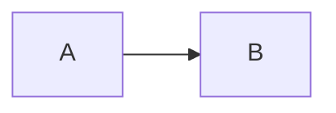

# Bayesian Federated Learning Documentation

This folder contains the official documentation for the current validated research prototype.

## Structure

| Folder | Purpose |
|---|---|
| [`design/`](design/README.md) | Source-code architecture, class/component dependencies, and sequence diagrams. |
| [`bayesFL/`](bayesFL/README.md) | Mathematical formulation of FedAvg, VI, OLA/FOLA, and sparse Bayesian communication, with source-code mapping. |
| [`metrics/`](metrics/README.md) | Collected metrics, output artifacts, generated plots, and plotting utilities. |

## Reading order

1. Read [`design/README.md`](design/README.md) to understand the code structure.
2. Read [`bayesFL/README.md`](bayesFL/README.md) to understand the mathematical meaning of each method.
3. Read [`metrics/README.md`](metrics/README.md) to understand what is logged and what plots can be generated.

## Mermaid preview

Mermaid.js diagrams are embedded directly in the Markdown files using fenced blocks:

````markdown

````

GitHub and recent VS Code Markdown preview extensions can render these blocks directly.
