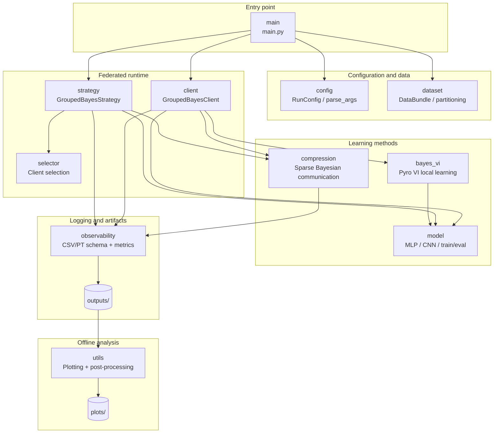
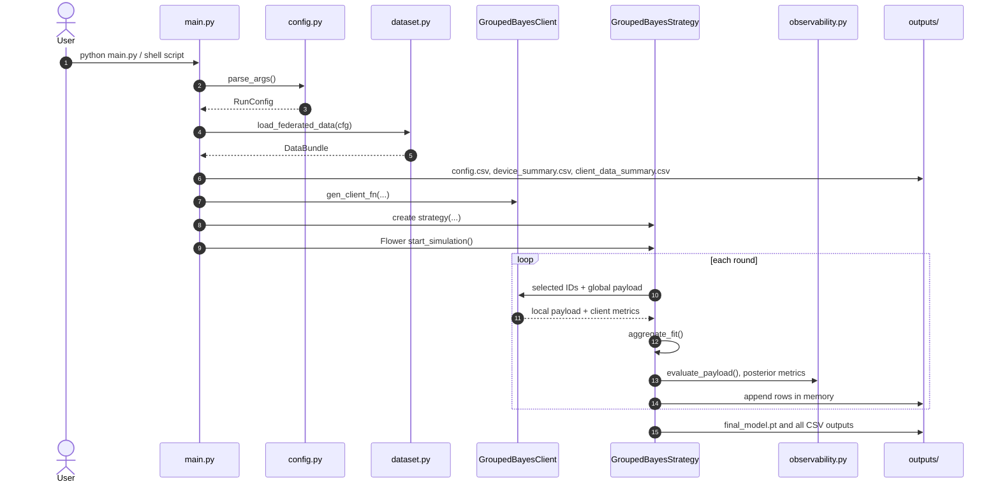
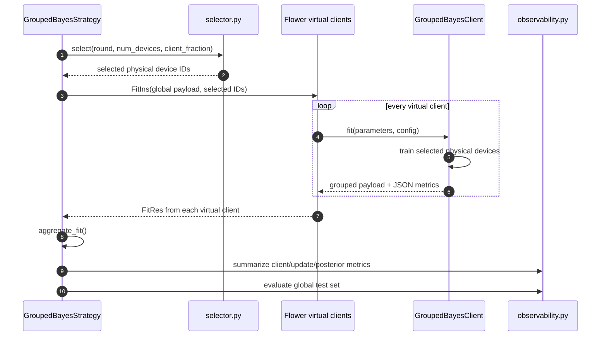
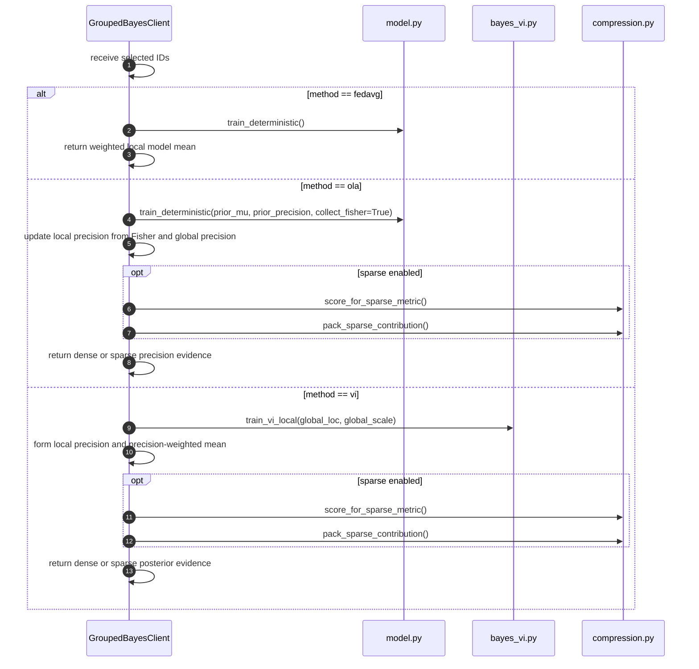
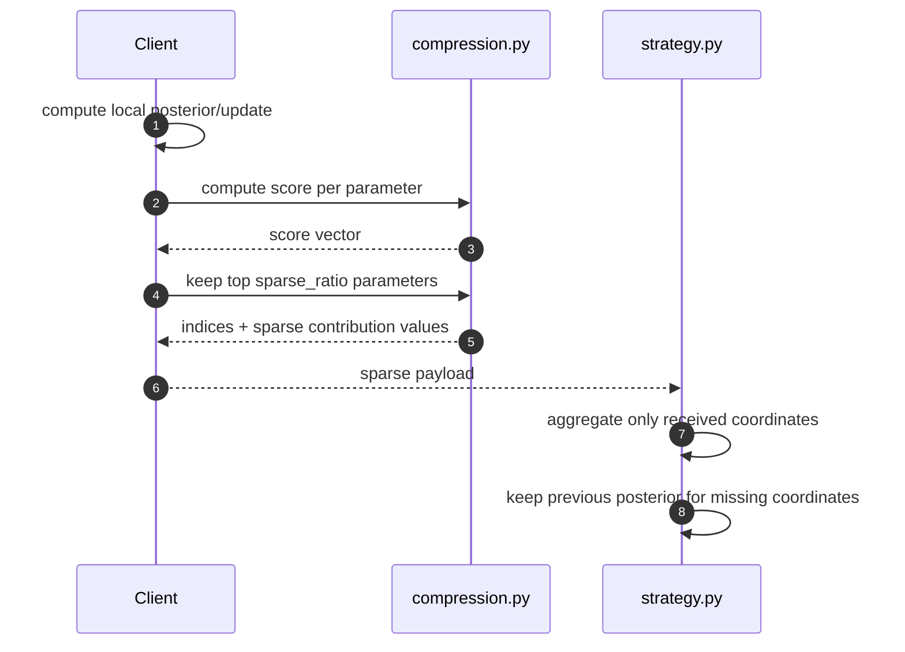

# Source Design Documentation

This document describes the source-code architecture of the Bayesian Federated Learning framework. It focuses on component responsibilities and runtime flow. Mathematical details are in [`../bayesFL/README.md`](../bayesFL/README.md), and metric/output details are in [`../metrics/README.md`](../metrics/README.md).

## Table of contents

1. [Class diagram](#1-class-diagram)
   - [1.1. Class dependency](#11-class-dependency)
   - [1.2. Class `main`](#12-class-main)
   - [1.3. Class `config`](#13-class-config)
   - [1.4. Class `dataset`](#14-class-dataset)
   - [1.5. Class `model`](#15-class-model)
   - [1.6. Class `bayes_vi`](#16-class-bayes_vi)
   - [1.7. Class `compression`](#17-class-compression)
   - [1.8. Class `client`](#18-class-client)
   - [1.9. Class `strategy`](#19-class-strategy)
   - [1.10. Class `selector`](#110-class-selector)
   - [1.11. Class `observability`](#111-class-observability)
   - [1.12. Class `utils`](#112-class-utils)
2. [Sequence diagram](#2-sequence-diagram)
   - [2.1. End-to-end experiment sequence](#21-end-to-end-experiment-sequence)
   - [2.2. Federated round sequence](#22-federated-round-sequence)
   - [2.3. Client local-training sequence](#23-client-local-training-sequence)
   - [2.4. Sparse Bayesian communication sequence](#24-sparse-bayesian-communication-sequence)
3. [Design usage guideline](#3-design-usage-guideline)

---

## 1. Class diagram

### 1.1. Class dependency

The diagram below uses broad design components instead of every function-level dependency. This keeps the dependency graph readable.



| Design class/component | Python module/object(s) | Main responsibility | Main dependencies |
|---|---|---|---|
| `main` | `main.py`, `main()` | Experiment entry point and Flower simulation launcher. | `config`, `dataset`, `client`, `strategy`, `model` |
| `config` | `config.py`, `RunConfig`, `parse_args()` | Central CLI/runtime configuration. | Python stdlib only |
| `dataset` | `dataset.py`, `DataBundle`, `load_federated_data()` | Dataset loading, non-IID/unbalanced partitioning, device metadata. | `config`, `torchvision`, `numpy` |
| `model` | `model.py`, `MLP`, `SmallCNN`, `train_deterministic()`, `evaluate()` | Deterministic neural network models and local SGD/Adam helpers. | `torch`, `config` |
| `bayes_vi` | `bayes_vi.py`, `BayesianMlpSpec`, `train_vi_local()` | Pyro-based mean-field VI local learning for MLP. | `pyro`, `torch`, `config` |
| `compression` | `compression.py`, `SparsePack`, scoring/packing functions | SNR/KL/precision-update scoring and sparse payload packing. | `numpy` |
| `client` | `client.py`, `GroupedBayesClient` | Flower virtual client that simulates grouped physical devices. | `model`, `bayes_vi`, `compression`, `observability` |
| `strategy` | `strategy.py`, `GroupedBayesStrategy` | Server-side selection, aggregation, evaluation, and metric saving. | `selector`, `model`, `compression`, `observability` |
| `selector` | `selector.py`, `SelectionResult`, selectors | Client selection policies. | `numpy`, `config` |
| `observability` | `observability.py`, schema constants, metric functions | CSV schemas, posterior summaries, calibration, SNR, evaluation metrics. | `model`, `torch`, `numpy` |
| `utils` | `utils.py` | Offline plotting, pruning, diagnostics, and metric summaries. | generated `outputs/` artifacts |

---

### 1.2. Class `main`

`main` is the orchestration component. It does not implement learning logic directly.

| Module/object | Purpose |
|---|---|
| `main.py` | Entry script executed by training shell scripts. |
| `setup_logging()` | Creates `run.log` inside the output folder. |
| `save_config_csv()` | Saves the active configuration as `config.csv`. |
| `initial_payload()` | Creates the initial Flower payload: FedAvg `[theta]`, OLA `[mu, precision]`, VI `[mu, scale]`. |
| `main()` | Parses config, loads data, creates client factory and strategy, starts Flower simulation, saves final artifacts. |

Usage guideline:

```bash
python main.py --method fedavg --dataset mnist --model mlp --num_rounds 5 --output_dir outputs/debug_run
```

Most users should not modify `main.py` unless changing the Flower runtime itself.

---

### 1.3. Class `config`

`config` centralizes all runtime options.

| Module/object | Purpose |
|---|---|
| `RunConfig` | Dataclass containing all experiment, data, method, sparse-communication, runtime, and plotting-related options. |
| `parse_args()` | Converts CLI arguments into `RunConfig`. |
| `str2bool()` | Allows CLI values such as `true`, `false`, `1`, `0`. |
| `int_list()` | Parses comma-separated MLP hidden-layer sizes. |

Usage guideline:

Add a new CLI argument in two places:

1. Add a field to `RunConfig`.
2. Add the corresponding `parser.add_argument(...)` entry in `parse_args()`.

---

### 1.4. Class `dataset`

`dataset` builds the federated dataset and simulated device population.

| Module/object | Purpose |
|---|---|
| `DataBundle` | Container for train/validation/test loaders, partition metadata, device groups, label counts, and device positions. |
| `load_federated_data()` | Loads MNIST/CIFAR-10 and partitions data across physical devices. |
| `partition_indices()` | Creates IID/non-IID and balanced/unbalanced client partitions. |
| `make_device_groups()` | Maps many physical devices to fewer Flower virtual clients. |
| `sample_device_positions()` | Creates synthetic distance/angle metadata for future wireless scheduling. |
| `save_client_data_summary()` | Writes `client_data_summary.csv`. |
| `save_device_summary()` | Writes `device_summary.csv`. |

Usage guideline:

Modify this module when adding a new dataset, new non-IID split, or new wireless/device metadata.

---

### 1.5. Class `model`

`model` owns deterministic models and deterministic local training.

| Module/object | Purpose |
|---|---|
| `MLP` | Main model used by MNIST and VI experiments. |
| `SmallCNN` | CNN scaffold for CIFAR-10 / deterministic methods. |
| `build_model()` | Creates the requested model. |
| `train_deterministic()` | Local SGD/Adam training for FedAvg and OLA/FOLA. Also collects Fisher for OLA. |
| `evaluate()` | Deterministic loss/accuracy evaluation. |
| Flatten/set helpers | Convert PyTorch parameters to/from Flower-compatible flat NumPy vectors. |

Usage guideline:

Add new architectures here first. After adding a new model, update `build_model()` and check whether VI supports the new architecture.

---

### 1.6. Class `bayes_vi`

`bayes_vi` contains the Pyro mean-field VI implementation.

| Module/object | Purpose |
|---|---|
| `BayesianMlpSpec` | Describes latent weight names and shapes for the MLP posterior. |
| `build_mlp_spec()` | Builds Pyro latent structure from the MLP architecture. |
| `split_flat()` | Converts a flat posterior vector into layer-wise tensors. |
| `logits_from_flat()` | Deterministic forward pass using posterior mean. |
| `_make_pyro_model()` | Creates Pyro model with Gaussian weight priors and categorical likelihood. |
| `train_vi_local()` | Runs SVI and returns local posterior mean, scale, and VI metrics. |

Usage guideline:

Modify this module when changing the Bayesian neural-network posterior family, Pyro guide, likelihood, or VI loss reporting.

---

### 1.7. Class `compression`

`compression` supports Bayesian pruning and sparse Bayesian communication.

| Module/object | Purpose |
|---|---|
| `SparsePack` | Sparse payload container with indices, values, score threshold, and compression stats. |
| `weight_snr()` | BBB-style weight SNR: `abs(mu) / sigma`. |
| `update_snr()` | FL communication score: `abs(local_mu - global_mu) / local_sigma`. |
| `precision_update_score()` | OLA/FOLA score: `abs(local_mu - global_mu) * local_precision`. |
| `diag_gaussian_kl_score()` | Per-coordinate KL score between local and global diagonal Gaussians. |
| `topk_mask()` | Keeps top-k coordinates by score. |
| `pack_sparse_contribution()` | Converts dense Bayesian contribution arrays into sparse index/value payloads. |
| `sparse_row_metrics()` | Produces per-client sparse communication metrics. |

Usage guideline:

Add new sparse communication policies here. Then expose the policy through `--sparse_metric` in `config.py`.

---

### 1.8. Class `client`

`client` implements Flower client-side work.

| Module/object | Purpose |
|---|---|
| `GroupedBayesClient` | A Flower virtual client that sequentially simulates multiple physical devices. |
| `_fit_fedavg()` | Local deterministic training for FedAvg. |
| `_fit_ola()` | Local deterministic training + Fisher/precision update for OLA/FOLA. |
| `_fit_vi()` | Local Pyro VI training and posterior contribution generation. |
| `_use_sparse_comm()` | Enables sparse Bayesian communication after warmup. |
| `_effective_vi_lr()` | Applies optional server-round-based VI LR decay. |
| `gen_client_fn()` | Flower client factory used by `main.py`. |

Usage guideline:

Modify this module when changing what each client sends back to the server.

---

### 1.9. Class `strategy`

`strategy` is the server-side controller.

| Module/object | Purpose |
|---|---|
| `GroupedBayesStrategy` | Flower strategy that handles selection, aggregation, global evaluation, and output saving. |
| `configure_fit()` | Selects physical devices and sends selection to all virtual clients. |
| `aggregate_fit()` | Aggregates FedAvg, VI, OLA/FOLA, and sparse Bayesian contributions. |
| `_aggregate_fedavg()` | Weighted average aggregation. |
| `_aggregate_product_precision()` | Precision-weighted Bayesian product aggregation. Supports sparse payloads. |
| `_aggregate_moment_match()` | Optional VI moment matching aggregation. |
| `evaluate()` | Global posterior-mean and posterior-MC evaluation. |
| `save_all_metrics()` | Writes all output CSV files. |
| `_maybe_save_best_checkpoints()` | Saves best accuracy/ECE/loss checkpoints. |

Usage guideline:

Modify this module when changing server aggregation, server evaluation, best checkpoint logic, or output artifact creation.

---

### 1.10. Class `selector`

`selector` isolates client selection logic.

| Module/object | Purpose |
|---|---|
| `SelectionResult` | Selected physical-client IDs for a round. |
| `BaseClientSelector` | Interface for selection policies. |
| `RandomClientSelector` | Current random client sampling policy. |
| `WirelessQualitySelector` | Placeholder for future wireless-aware scheduling. |
| `build_selector()` | Factory used by the server strategy. |

Usage guideline:

Implement future channel-aware scheduling here, then add policy names to `config.py`.

---

### 1.11. Class `observability`

`observability` centralizes all metric schemas and evaluation helpers.

| Module/object | Purpose |
|---|---|
| CSV field constants | Stable column definitions for all output CSV files. |
| `evaluate_payload()` | Evaluates deterministic or MC posterior predictive performance. |
| `posterior_global_metrics()` | Computes posterior sigma, precision, entropy, SNR summaries. |
| `posterior_summary_rows()` | Layer-wise posterior statistics. |
| `snr_histogram_rows()` | Density/CDF histogram rows for SNR plots. |
| `summarize_client_rows()` | Aggregates per-client training metrics to round metrics. |
| `write_csv()` | Stable CSV writing utility. |

Usage guideline:

When adding a metric, update both the row-producing code and the appropriate field list here.

---

### 1.12. Class `utils`

`utils` is offline-only. It does not participate in training.

| Command/function group | Purpose |
|---|---|
| `mix` / `plot_mixed_metrics()` | Compare one metric across many run folders. |
| `selected` | Plot selected-client count per round. |
| `radar` | Plot device distribution around server. |
| `calibration` | Plot reliability diagram from `calibration_bins.csv`. |
| `snr` / `snr-evolution` | Plot SNR density/CDF and evolution over rounds. |
| `prune` / `prune-plot` | Post-hoc BBB-style pruning and plotting. |
| `diagnostics` | One-run diagnostic dashboard. |
| `compare-diagnostics` | Best-vs-final and accuracy/calibration comparison across runs. |
| `heterogeneity` | Client label-skew/update/sparse-communication plots. |

Usage guideline:

Run `python utils.py --help` and then `python utils.py <command> --help` for command-specific usage.

---

## 2. Sequence diagram

### 2.1. End-to-end experiment sequence



### 2.2. Federated round sequence



### 2.3. Client local-training sequence



### 2.4. Sparse Bayesian communication sequence



---

## 3. Design usage guideline

Use this document when you need to answer:

- Where should I modify code for a new method?
- Which file owns aggregation?
- Which file owns local training?
- Which file writes metrics?
- Which file creates plots?

Common extension map:

| Extension | Modify first | Then update |
|---|---|---|
| New CLI option | `config.py` | scripts and docs |
| New dataset split | `dataset.py` | `client_data_summary.csv` docs |
| New model | `model.py` | `bayes_vi.py` if Bayesian VI needs support |
| New Bayesian method | `client.py`, `strategy.py` | `observability.py`, `utils.py` |
| New sparse score | `compression.py` | `config.py`, `client.py`, metric docs |
| New wireless scheduler | `selector.py` | `config.py`, `communication_metrics.csv` |
| New metric | producer file + `observability.py` | `utils.py`, `doc/metrics/README.md` |
| New plot | `utils.py` | plot scripts and `doc/metrics/README.md` |
