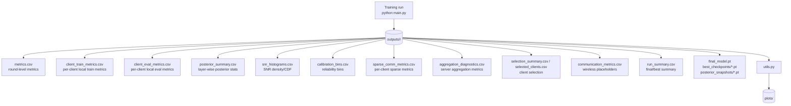

# Metrics, Output Artifacts, and Plot Documentation

This document describes the metrics collected during training, the CSV/PT artifacts written to `outputs/`, and the plots generated under `plots/`. Source-code architecture is described in [`../design/README.md`](../design/README.md). Method formulas are described in [`../bayesFL/README.md`](../bayesFL/README.md).

## Table of contents

1. [Output artifact map](#1-output-artifact-map)
2. [Training output folder structure](#2-training-output-folder-structure)
3. [Metric files](#3-metric-files)
   - [3.1. `metrics.csv`](#31-metricscsv)
   - [3.2. `client_train_metrics.csv`](#32-client_train_metricscsv)
   - [3.3. `client_eval_metrics.csv`](#33-client_eval_metricscsv)
   - [3.4. `posterior_summary.csv`](#34-posterior_summarycsv)
   - [3.5. `snr_histograms.csv`](#35-snr_histogramscsv)
   - [3.6. `calibration_bins.csv`](#36-calibration_binscsv)
   - [3.7. `sparse_comm_metrics.csv`](#37-sparse_comm_metricscsv)
   - [3.8. `aggregation_diagnostics.csv`](#38-aggregation_diagnosticscsv)
   - [3.9. `selection_summary.csv` and `selected_clients.csv`](#39-selection_summarycsv-and-selected_clientscsv)
   - [3.10. `communication_metrics.csv`](#310-communication_metricscsv)
   - [3.11. `run_summary.csv`](#311-run_summarycsv)
   - [3.12. `pruning_eval.csv`](#312-pruning_evalcsv)
4. [Saved model and posterior artifacts](#4-saved-model-and-posterior-artifacts)
5. [Plot folder structure](#5-plot-folder-structure)
6. [Plot catalog](#6-plot-catalog)
7. [`utils.py` command guide](#7-utilspy-command-guide)
8. [How to add new metrics or plots](#8-how-to-add-new-metrics-or-plots)

---

## 1. Output artifact map



All training outputs are written as CSV, `.pt`, or `.log` files. Plot images are generated later by `utils.py` or scripts in `scripts/plot/`.

---

## 2. Training output folder structure

A typical run folder looks like:

```text
outputs/<run_name>/
├── aggregation_diagnostics.csv
├── calibration_bins.csv
├── client_data_summary.csv
├── client_eval_metrics.csv
├── client_train_metrics.csv
├── communication_metrics.csv
├── config.csv
├── device_summary.csv
├── final_model.pt
├── metrics.csv
├── posterior_snapshots/
├── posterior_summary.csv
├── pruning_eval.csv
├── run.log
├── run_summary.csv
├── selected_clients.csv
├── selection_summary.csv
├── snr_histograms.csv
└── sparse_comm_metrics.csv
```

Some files are empty or contain only headers when the method does not use that feature. For example, FedAvg has no true Bayesian posterior uncertainty, so some posterior or sparse fields may be empty or `NaN`.

---

## 3. Metric files

The stable CSV schemas are centralized in `observability.py`. The main schema groups are declared near `METRICS_FIELDS`, `CLIENT_TRAIN_FIELDS`, `POSTERIOR_SUMMARY_FIELDS`, `SNR_HISTOGRAM_FIELDS`, `CALIBRATION_BIN_FIELDS`, `SPARSE_COMM_FIELDS`, and `RUN_SUMMARY_FIELDS` in `observability.py` lines 143-307.

### 3.1. `metrics.csv`

`metrics.csv` is the main round-level file. One row corresponds to one evaluated server round.

Important metric groups:

| Group | Example columns | Meaning |
|---|---|---|
| Run identity | `run_id`, `round`, `method`, `dataset`, `model`, `seed` | Identifies the experiment and round. |
| Federated setup | `num_devices`, `num_virtual_clients`, `client_fraction`, `selected_count` | Population and selection setup. |
| Runtime | `round_time_sec`, `fit_time_sec`, `aggregate_time_sec`, `eval_time_sec` | Wall-time diagnostics. |
| Global deterministic performance | `global_accuracy`, `global_loss`, `global_nll`, `global_brier`, `global_ece` | Main comparison metrics. For VI/OLA these are posterior-mean metrics. |
| Posterior-mean explicit metrics | `global_mean_accuracy`, `global_mean_loss`, `global_mean_ece` | Explicit `theta = mu` evaluation. |
| Posterior-MC metrics | `global_mc_accuracy`, `global_mc_loss`, `global_mc_ece`, `global_mc_samples` | Bayesian posterior-predictive evaluation. |
| Uncertainty | `global_predictive_entropy`, `global_expected_entropy`, `global_mutual_information`, `global_epistemic_uncertainty` | Predictive uncertainty summaries. |
| Local summaries | `local_accuracy_weighted`, `local_loss_weighted`, `local_global_acc_gap_mean` | Aggregated local validation behavior. |
| Update drift | `client_update_l2_mean`, `client_update_cosine_mean` | How much local models/posteriors differ from global state. |
| VI-specific | `vi_elbo_loss_mean`, `vi_kl_loss_mean`, `vi_likelihood_loss_mean`, `vi_scale_mean`, `vi_effective_lr_mean` | VI optimization and posterior behavior. |
| OLA-specific | `ola_prior_loss_mean`, `ola_prior_loss_raw_mean`, `ola_task_loss_mean`, `ola_fisher_mean`, `ola_precision_mean`, `ola_sigma_mean` | OLA prior/Fisher/precision behavior. |
| Posterior summaries | `posterior_sigma_mean`, `posterior_precision_mean`, `posterior_snr_raw_p50`, `posterior_snr_frac_gt_1` | Global posterior concentration and confidence. |
| Sparse communication | `sparse_comm_enabled`, `sparse_ratio`, `communication_saving_ratio`, `communication_compression_ratio` | Sparse Bayesian communication efficiency. |
| Selection metadata | `selected_label_entropy_mean`, `selected_kl_to_global_label_mean` | Non-IID difficulty of selected clients. |

Source mapping:

| Producer | Source mapping |
|---|---|
| Base row fields | `observability.py`, `base_round_row()`, lines 309-340. |
| Global performance and MC metrics | `strategy.py`, `evaluate()`, lines 571-624. |
| Aggregated client and sparse summaries | `strategy.py`, `aggregate_fit()`, lines 286-379. |
| CSV writing | `strategy.py`, `save_history_csv()`, lines 751-752. |

---

### 3.2. `client_train_metrics.csv`

One row corresponds to one physical client trained in one round.

| Metric group | Example columns | Meaning |
|---|---|---|
| Client identity | `round`, `physical_client_id`, `virtual_client_id`, `num_examples` | Physical device and grouped virtual client. |
| Local train loss | `train_loss`, `task_loss`, `prior_loss`, `regularization_loss` | Local objective decomposition. |
| Local update | `update_l2_norm`, `update_linf_norm`, `update_cosine_to_global` | Local drift from global state. |
| Data heterogeneity | `label_entropy`, `kl_to_global_label_distribution` | Non-IID label distribution metadata. |
| VI metrics | `vi_elbo_loss`, `vi_kl_loss`, `vi_likelihood_loss`, `vi_scale_mean`, `vi_snr_raw_p50` | Local VI behavior. |
| OLA metrics | `ola_fisher_mean`, `ola_precision_mean`, `ola_sigma_mean`, `ola_snr_raw_p50` | Local OLA posterior behavior. |
| Sparse metrics | `sparse_num_params_sent`, `sparse_compression_ratio`, `sparse_threshold`, `sparse_sent_update_fraction_l2` | Per-client sparse communication. |

Source mapping:

| Producer | Source mapping |
|---|---|
| FedAvg local rows | `client.py`, `_fit_fedavg()`, lines 207-219. |
| OLA local rows | `client.py`, `_fit_ola()`, lines 311-340. |
| VI local rows | `client.py`, `_fit_vi()`, lines 449-476. |
| Schema | `observability.py`, `CLIENT_TRAIN_FIELDS`, lines 225-239. |

---

### 3.3. `client_eval_metrics.csv`

This file records local validation metrics when `--local_eval_every > 0`.

| Column group | Meaning |
|---|---|
| `local_accuracy`, `local_loss`, `local_nll` | Local validation performance. |
| `local_global_accuracy_gap`, `local_global_loss_gap` | Difference between local behavior and global reference where available. |
| `label_entropy`, `kl_to_global_label_distribution` | Heterogeneity metadata for interpreting local evaluation. |

Source mapping: `client.py`, `_maybe_eval_local_model()`, lines 123-147, and VI local validation path lines 477-500.

---

### 3.4. `posterior_summary.csv`

Layer-wise posterior statistics. Useful for understanding which layers are uncertain or high-SNR.

| Column group | Meaning |
|---|---|
| `layer_name`, `param_name`, `num_params` | Layer/parameter identity. |
| `mu_*` | Posterior mean magnitude/statistics. |
| `sigma_*` | Posterior standard deviation statistics. |
| `precision_*` | Posterior precision statistics. |
| `snr_raw_*`, `snr_db_*` | Signal-to-noise summaries. |
| `effective_params_snr_gt_*` | Number of parameters above SNR thresholds. |

Source mapping: `observability.py`, `posterior_summary_rows()`, around line 460; schema lines 248-255.

---

### 3.5. `snr_histograms.csv`

Histogram rows for SNR density and CDF plots.

| Column | Meaning |
|---|---|
| `round` | Server round. |
| `layer_name` | Usually `all` or a specific layer. |
| `value_space` | `raw` or `db`. |
| `bin_left`, `bin_right`, `bin_center` | Histogram bin. |
| `count`, `density`, `cdf` | Histogram and cumulative distribution. |

Source mapping: `observability.py`, `snr_histogram_rows()`, around line 519; schema lines 257-259.

---

### 3.6. `calibration_bins.csv`

Reliability-diagram data for ECE/MCE analysis.

| Column | Meaning |
|---|---|
| `bin_left`, `bin_right` | Confidence bin range. |
| `bin_count` | Number of predictions in the bin. |
| `bin_accuracy` | Accuracy of predictions in the bin. |
| `bin_confidence` | Mean confidence of predictions in the bin. |
| `bin_gap` | Absolute calibration gap. |
| `ece_contribution` | Contribution to total ECE. |

Source mapping: `observability.py`, `evaluate_payload()`, around line 580; schema lines 261-263.

---

### 3.7. `sparse_comm_metrics.csv`

Per-client sparse communication rows. This is important for sparse Bayesian communication studies.

| Column group | Meaning |
|---|---|
| `sparse_metric`, `sparse_ratio`, `sparse_warmup_rounds` | Sparse communication configuration. |
| `sparse_num_params_total`, `sparse_num_params_sent` | Total and transmitted parameter counts. |
| `sparse_compression_ratio` | Fraction of parameters sent. |
| `sparse_threshold` | Top-k score threshold. |
| `sparse_score_mean`, `sparse_score_p50`, `sparse_score_p90` | Score distribution summary. |
| `sparse_sent_update_l2`, `sparse_dropped_update_l2` | Norms of transmitted/dropped updates. |
| `sparse_sent_update_fraction_l2` | Fraction of update norm retained by sparse mask. |

Source mapping: `compression.py`, `sparse_row_metrics()`, lines 197-248; schema in `observability.py`, lines 288-295.

---

### 3.8. `aggregation_diagnostics.csv`

Server aggregation diagnostics for each round.

| Column group | Meaning |
|---|---|
| `aggregation_delta_l2`, `aggregation_delta_linf`, `aggregation_delta_cosine` | Change from previous global state. |
| `aggregation_weight_entropy`, `aggregation_weight_min`, `aggregation_weight_max` | Distribution of client aggregation weights. |
| `client_update_l2_mean`, `client_update_cosine_mean` | Aggregated client update behavior. |
| `posterior_product_*` | Product-posterior precision and sigma summaries. |

Source mapping: `strategy.py`, aggregation row construction lines 293-318; schema in `observability.py`, lines 276-282.

---

### 3.9. `selection_summary.csv` and `selected_clients.csv`

These files record which physical clients were selected and their metadata.

| File | Meaning |
|---|---|
| `selection_summary.csv` | One row per round with selection count, selected examples, mean selected label entropy, and selected KL to global label distribution. |
| `selected_clients.csv` | One row per selected physical client per round, including virtual-client group, label entropy, distance, and wireless placeholder fields. |

Source mapping: `strategy.py`, `_record_selection_rows()`, lines 135-223.

---

### 3.10. `communication_metrics.csv`

Currently this mostly contains placeholders for future wireless-aware communication.

| Column group | Intended meaning |
|---|---|
| `distance_m`, `angle_rad` | Device geometry around server. |
| `channel_snr_db`, `pathloss_db`, `rate_mbps` | Future digital/wireless metadata. |
| `analog_ota_enabled`, `ota_noise_power`, `ota_distortion`, `ota_mse` | Future analog OTA aggregation metadata. |
| `payload_bytes`, `communication_success` | Future communication success/cost logging. |

Source mapping: `strategy.py`, communication row construction lines 194-223; schema in `observability.py`, lines 284-286.

---

### 3.11. `run_summary.csv`

One-row summary of a completed run.

Important fields:

| Column | Meaning |
|---|---|
| `final_global_accuracy`, `final_global_loss`, `final_global_ece` | Final-round performance. |
| `best_global_accuracy`, `best_global_accuracy_round` | Best accuracy over all evaluated rounds. |
| `best_global_ece`, `best_global_ece_round` | Best calibration round. |
| `accuracy_drop_best_to_final` | Late-round degradation indicator. |
| `best_accuracy_model_path`, `best_ece_model_path`, `best_loss_model_path` | Best checkpoints. |

Source mapping: `strategy.py`, `_build_run_summary()`, lines 776-832.

---

### 3.12. `pruning_eval.csv`

Post-hoc BBB-style pruning evaluation.

| Column | Meaning |
|---|---|
| `prune_fraction`, `kept_fraction` | Fraction removed/kept. |
| `num_params_total`, `num_params_kept`, `num_params_pruned` | Pruning size. |
| `accuracy_after_prune`, `loss_after_prune`, `ece_after_prune` | Performance after pruning. |
| `threshold_raw`, `threshold_db` | SNR threshold used for pruning. |

Source mapping: `utils.py`, `run_posthoc_pruning()`, around lines 824-928; schema in `observability.py`, lines 302-307.

---

## 4. Saved model and posterior artifacts

| Artifact | Meaning |
|---|---|
| `final_model.pt` | Final posterior mean / model state. |
| `posterior_snapshots/final.pt` | Final posterior snapshot with `mu`, `sigma` or `precision`, payload, and metadata. |
| `posterior_snapshots/round_XXXX.pt` | Intermediate posterior snapshots. |
| `best_checkpoints/best_accuracy_model.pt` | Checkpoint with best global accuracy. |
| `best_checkpoints/best_ece_model.pt` | Checkpoint with best ECE. |
| `best_checkpoints/best_loss_model.pt` | Checkpoint with best global loss. |

Source mapping: `strategy.py`, `save_posterior_snapshot()` lines 662-691, `_save_payload_checkpoint()` lines 694-723, `_maybe_save_best_checkpoints()` lines 725-746, and `save_model()` lines 834-853.

---

## 5. Plot folder structure

The current validated experiments produce plot groups such as:

```text
plots/
├── final_compare_mnist_noniid_unbalanced/
│   ├── fa_vs_ola/
│   ├── fa_vs_vi/
│   ├── ola_pruning/
│   └── vi_pruning/
├── sparse_comm_mnist_noniid_unbalanced/
│   ├── vi_ratio_sweep/
│   └── ola_ratio_sweep/
├── research_diagnostics_mnist_noniid_unbalanced/
│   ├── dense_compare_best_final/
│   ├── final_best_method_compare/
│   ├── vi_sparse_keep010_decay/
│   └── ...
├── tune_vi_mnist_noniid_unbalanced/
└── tune_ola_mnist_noniid_unbalanced/
```

---

## 6. Plot catalog

### 6.1. Final comparison plots

Generated by scripts such as:

```bash
bash scripts/plot/plot_compare_fedavg_ola_mnist_noniid_unbalanced_seed42.sh
bash scripts/plot/plot_compare_fedavg_vi_mnist_noniid_unbalanced_seed42.sh
```

| Folder | Meaning |
|---|---|
| `performance/` | Accuracy/loss/ECE/NLL/Brier/local performance vs round. |
| `fl_dynamics/` | Client selection, update norm, aggregation delta, aggregation entropy. |
| `runtime/` | Round/fit/aggregate/eval time. |
| `bayesian_posterior/` | Posterior sigma, precision, SNR, VI/OLA-specific Bayesian metrics. |
| `calibration_*` | Reliability diagrams for final/best rounds. |
| `snr_*` | SNR density/CDF plots. |
| `ola_characteristics/`, `vi_characteristics/` | Method-specific diagnostic plots. |

### 6.2. Sparse ratio sweep plots

Generated by:

```bash
bash scripts/plot/plot_sparse_vi_mnist_noniid_unbalanced_update_snr_ratio_sweep_seed42.sh
bash scripts/plot/plot_sparse_ola_mnist_noniid_unbalanced_precision_update_ratio_sweep_seed42.sh
```

Important plots:

| Plot | Meaning |
|---|---|
| `summary/final_global_accuracy_vs_drop_fraction.png` | Accuracy tradeoff as communication becomes more sparse. |
| `summary/best_global_accuracy_vs_drop_fraction.png` | Best achievable accuracy per sparse ratio. |
| `summary/final_global_ece_vs_drop_fraction.png` | Calibration tradeoff per sparse ratio. |
| `summary/accuracy_vs_communication_saving.png` | Pareto plot of accuracy and communication saving. |
| `communication/mix_communication_saving_ratio_round.png` | Round-wise communication saving. |
| `sparse_client_aggregates/*.png` | Per-round aggregate sparse score/threshold/update-retention behavior. |

### 6.3. Research diagnostic plots

Generated by:

```bash
bash scripts/plot/plot_diagnostics_mnist_noniid_unbalanced_research_v1.sh
```

| Plot | Meaning |
|---|---|
| `accuracy_drop_best_to_final.png` | Late-round degradation. Important for dense VI analysis. |
| `accuracy_calibration_tradeoff.png` | Accuracy vs ECE tradeoff across runs. |
| `accuracy_uncertainty_snr_overlay.png` | Accuracy, posterior sigma, and SNR trend together. |
| `local_global_accuracy_gap.png` | Local/global gap under non-IID clients. |
| `accuracy_vs_wall_time.png` | Accuracy as a function of cumulative runtime. |
| `cumulative_communication_bytes.png` | Dense/sparse cumulative communication cost. |
| `snr_density_evolution_all_db.png` | Evolution of SNR distribution over rounds. |
| `heterogeneity/*.png` | Data heterogeneity vs update/sparse behavior. |

### 6.4. Post-hoc pruning plots

Generated by:

```bash
python utils.py prune-plot --pruning outputs/<run>/pruning_eval.csv --output_dir plots/<name>_pruning
```

| Plot | Meaning |
|---|---|
| `pruning_accuracy_after_prune.png` | Accuracy after pruning low-SNR weights. |
| `pruning_loss_after_prune.png` | Loss after pruning. |
| `pruning_ece_after_prune.png` | Calibration after pruning. |
| `pruning_num_params_kept.png` | Number/fraction of parameters retained. |

---

## 7. `utils.py` command guide

Common commands:

```bash
# Compare metric curves across run folders
python utils.py mix \
  --runs fedavg=outputs/final_compare_mnist_noniid_unbalanced/fedavg_seed42 \
         vi=outputs/final_compare_mnist_noniid_unbalanced/vi_seed42 \
  --metrics global_accuracy global_loss global_ece \
  --output_dir plots/custom_compare

# Reliability diagram
python utils.py calibration \
  --calibration outputs/<run>/calibration_bins.csv \
  --round 200 \
  --eval_scope global_test \
  --output_dir plots/custom_calibration

# SNR density/CDF
python utils.py snr \
  --snr outputs/<run>/snr_histograms.csv \
  --round 200 \
  --layer all \
  --value_space db \
  --output_dir plots/custom_snr

# One-run diagnostics
python utils.py diagnostics \
  --run outputs/<run> \
  --output_dir plots/custom_diagnostics

# Compare best vs final across runs
python utils.py compare-diagnostics \
  --runs runA=outputs/runA runB=outputs/runB \
  --output_dir plots/custom_best_final

# Client heterogeneity plots
python utils.py heterogeneity \
  --run outputs/<run> \
  --output_dir plots/custom_heterogeneity
```

Use:

```bash
python utils.py --help
python utils.py <command> --help
```

for command-specific arguments.

---

## 8. How to add new metrics or plots

### 8.1. Add a new training metric

1. Decide where the value is produced:
   - local client: `client.py`
   - server aggregation/evaluation: `strategy.py`
   - posterior/evaluation helper: `observability.py`
2. Add the value to the produced row dictionary.
3. Add the column name to the correct field list in `observability.py`.
4. Add plotting support in `utils.py` if needed.
5. Update this document.

### 8.2. Add a new plot

1. Add a plotting function in `utils.py`.
2. Add a CLI subcommand in `utils.py main()`.
3. Add the command to a script in `scripts/plot/` if it should be part of a standard workflow.
4. Document the plot in this file.

### 8.3. Recommended naming rules

| Artifact | Naming rule |
|---|---|
| Round-level metrics | `metric_name` or `method_metric_name` in `metrics.csv`. |
| Per-client metrics | same concept, but per physical device in `client_train_metrics.csv`. |
| Sparse communication metrics | start with `sparse_` or `communication_`. |
| Posterior metrics | start with `posterior_`, `global_mean_`, or `global_mc_`. |
| Plot folders | group by experiment, then purpose: `performance/`, `communication/`, `summary/`, `diagnostics/`. |

